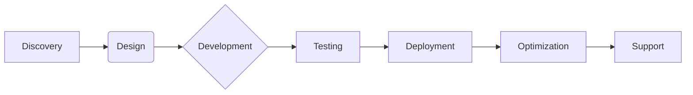

#  Cygen Solutions

> **Technology Architects ∙ Innovation Catalysts ∙ Digital Transformation Partners**


## 🚀 Enterprise-Grade Technology Solutions

We architect cutting-edge digital infrastructure and intelligent systems for global businesses. Specializing in mission-critical solutions that drive operational efficiency, enhance security, and transform customer experiences.

---

## 🔍 Core Expertise Matrix

| Domain              | Technologies & Capabilities                          |
|---------------------|------------------------------------------------------|
| **Cloud Solutions** | AWS • Azure • Google Cloud • OpenStack • Kubernetes  |
| **Telephony**       | FreeSWITCH • Kamailio • SIP/RTP • VoIP Security     |
| **AI Systems**      | Conversational AI • LLM Integration • RAG Pipelines |
| **Cybersecurity**   | Network Forensics • Wireshark • Suricata • NGFW     |
| **Web/Mobile**      | React • Flutter • Node.js • Microservices           |
| **Automation**      | CI/CD Pipelines • Terraform • Ansible • Chatbots    |

---

## 🏆 Flagship Products

<div align="center">
  
[](https://voiceinfra.ai)
> Carrier-grade communication platforms with AI-powered call analytics

[](https://smartprep.tech)
> AI-driven education technology with personalized learning pathways

[](https://examify.net)
> Secure digital assessment platform with biometric verification

</div>

---

## 🛠️ Service Spectrum



- **Custom Software Development**: Full lifecycle product engineering
- **Cloud Migration & Management**: Hybrid/multi-cloud deployments
- **Telephony Transformation**: SIP trunking to custom PBX solutions
- **AI Integration**: LLM-powered workflows and automation
- **Security Hardening**: Pen testing • Threat modeling • Compliance

---

## 💡 Innovation Principles

```diff
+ Zero-Trust Security Architecture
+ Infrastructure-as-Code Philosophy
+ Microservices-First Approach
+ Continuous Threat Monitoring
+ API-Driven Integrations
```

---

## 🌐 Connect With Us

[](https://www.cygen.solutions)
[](mailto:izhar@cygen.solutions)
[](https://linkedin.com/company/cygensolutions)

---

## ⚖️ Legal & Compliance

### Copyright Notice
© 2020-2025 Cygen Solutions. All intellectual property in repositories and associated assets is protected under international copyright laws (Berne Convention). 

### Usage Restrictions
```diff
- Strictly prohibited without written consent:
   • Commercial exploitation of code assets
   • Reverse engineering of proprietary systems
   • Redistribution of solution architectures
   • Production deployment of demo assets
```

**Legal Contact**: [izhar@cygen.solutions](mailto:izhar@cygen.solutions)

---

<div align="center">
  
  <br/>
  <sub>"Engineering Tomorrow's Digital Foundation"</sub>
</div>
